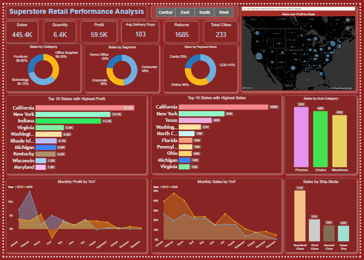

# 🛒 Superstore Retail Performance Analysis | Power BI Dashboard

An interactive single-page Power BI dashboard analyzing retail performance across the United States — covering sales, profit, returns, and customer segment trends with region-level filtering.

---

## 🖼️ Dashboard Preview



---

## 📁 Repository Structure

```
superstore-powerbi-dashboard/
├── README.md
├── superstore_retail_analysis.pbix     ← Power BI report file
├── data/
│   └── superstore_data.csv             ← Source dataset
└── images/
    └── dash.png                        ← Dashboard screenshot
```

---

## 📌 Dashboard Overview

A single-page Power BI report built to analyze retail KPIs across categories, segments, states, and shipping modes with interactive region filter buttons.

### 🔢 KPI Cards
| Metric | Value |
|---|---|
| Total Sales | 445.4K |
| Total Quantity | 6.4K |
| Total Profit | 59.5K |
| Avg Delivery Days | 103 |
| Total Returns | 1,685 |
| Total Cities | 233 |

---

## 📊 Visuals Included

- **Sales by Category** — Donut chart: Technology (35.12%), Office Supplies (36.25%), Furniture (28.62%)
- **Sales by Segment** — Donut chart: Consumer (48%), Corporate (30%), Home Office (22%)
- **Sales by Payment Mode** — Donut chart: COD (41%), Online (36%), Cards (23%)
- **Sales and Profit by State** — US geographic bubble map for state-wise distribution
- **Top 10 States by Highest Profit** — Horizontal bar chart (California leads at 17.5K)
- **Top 10 States by Highest Sales** — Horizontal bar chart (California leads at 108K)
- **Sales by Sub-Category** — Bar chart: Phones (62K), Chairs (49K), Machines (45K)
- **Monthly Profit by YoY** — Line chart comparing 2019 vs 2020 monthly profit trends
- **Monthly Sales by YoY** — Line chart comparing 2019 vs 2020 monthly sales trends
- **Sales by Ship Mode** — Bar chart: Standard Class (71K), First Class (31K), Second Class (22K), Same Day (22K)

---

## 🎛️ Filters and Interactivity

- **Region Filter Buttons** — Central | East | South | West
- All visuals are cross-filtered and interactive

---

## 🔑 Key Insights

- **Technology** is the top-selling category at 35.12% of total sales
- **California** leads both in highest sales (108K) and highest profit (17.5K)
- **Consumer segment** drives nearly half (48%) of all sales
- **COD** is the most preferred payment mode at 41%
- **Standard Class** shipping accounts for the majority of orders (71K)
- **Phones** are the best-selling sub-category at 62K

---

## 🛠️ Tools Used

| Tool | Purpose |
|---|---|
| Power BI Desktop | Dashboard design and DAX measures |
| SQL | Data extraction and cleaning |
| Microsoft Excel | Data pre-processing and validation |
| CSV | Source data format |

---

## 🚀 How to Use

1. Clone or download this repository
2. Open `superstore_retail_analysis.pbix` in **Power BI Desktop**
3. Use the **Central / East / South / West** buttons to filter by region
4. Click any visual to cross-filter the entire dashboard

---

## 📬 Contact

- 🔗 LinkedIn: [linkedin.com/in/srivatchan2004](https://www.linkedin.com/in/srivatchan2004/)
- 🐙 GitHub: [github.com/srivatchan2004](https://github.com/srivatchan2004)
